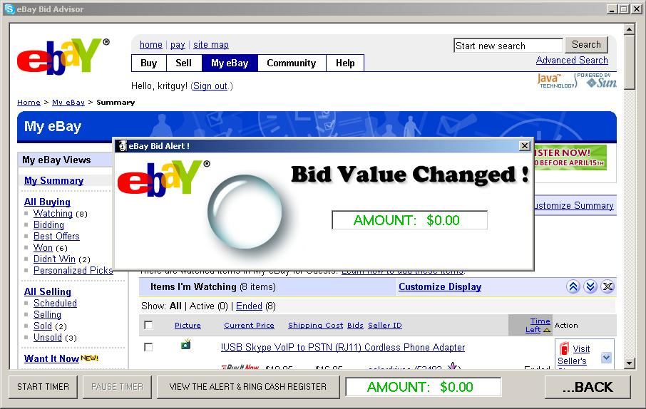



## eBay Bid Advisor for Sellers

### Description

A COOL eBay Seller's tool...

eBay Selling is fun. But when eBay sellers want to be informed when people have made bids on their items, this is a neat Alert program.

Every 30 seconds the application checks eBay to see if somebody has made a bid. If so, it rings a cash register sound and pops an Alert onto the screen.

If you like it, please do vote. (I will remember you in my will :-)
 
### More Info
 
It BUILDS the Cash Register WAV file automatically when first used. I didn't invent the WAV file, it's the Windows one - but it builds it anyway.

Happiness

You need to be a registered eBay Seller for this to work.

             |
---                |---
**Submitted On**   |2006-04-07 15:05:38
**By**             |[Kevin Ritch](https://github.com/Planet-Source-Code/PSCIndex/blob/master/ByAuthor/kevin-ritch.md)
**Level**          |Intermediate
**User Rating**    |4.3 (17 globes from 4 users)
**Compatibility**  |VB 4\.0 \(32\-bit\), VB 5\.0, VB 6\.0
**Category**       |[Internet/ HTML](https://github.com/Planet-Source-Code/PSCIndex/blob/master/ByCategory/internet-html__1-34.md)
**World**          |[Visual Basic](https://github.com/Planet-Source-Code/PSCIndex/blob/master/ByWorld/visual-basic.md)
**Archive File**   |[eBay\_Bid\_A198576472006\.zip](https://github.com/Planet-Source-Code/kevin-ritch-ebay-bid-advisor-for-sellers__1-64951/archive/master.zip)

### API Declarations

There are NO DLLs to install. No OCX's or anything else. No Registry things. It is a completely self-contained application for eBay sellers.

